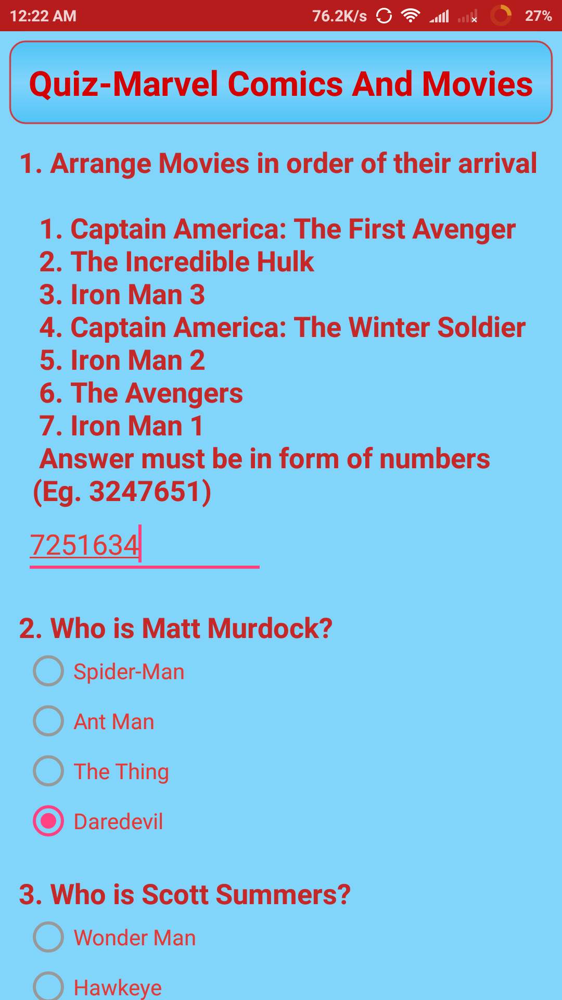
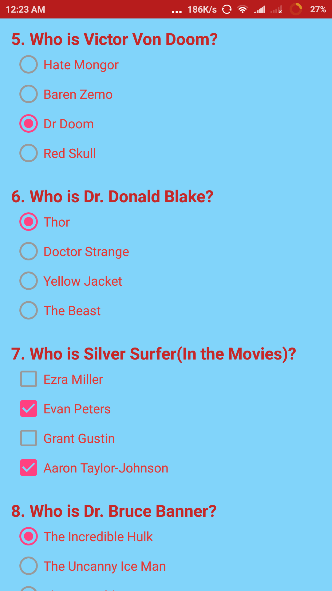
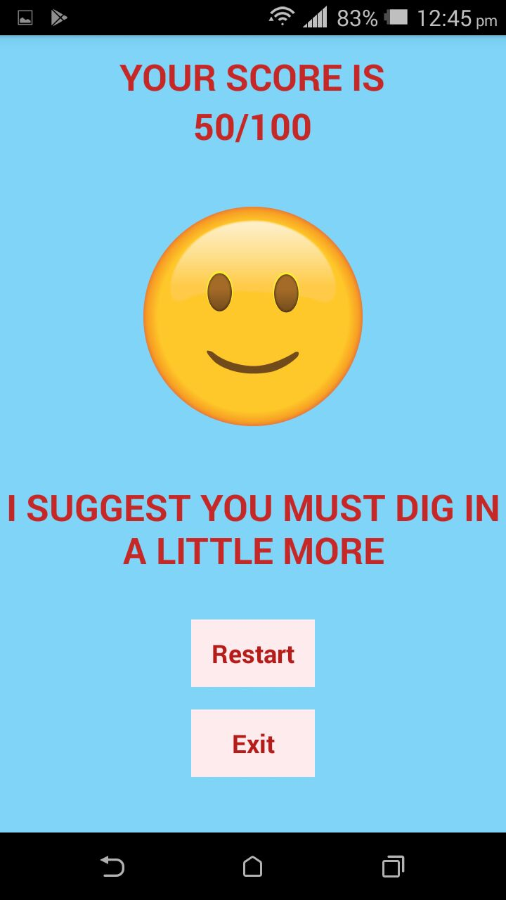
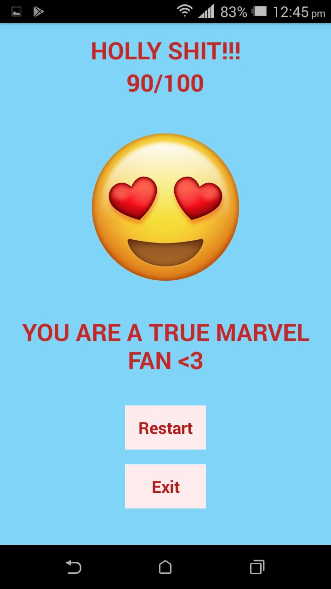
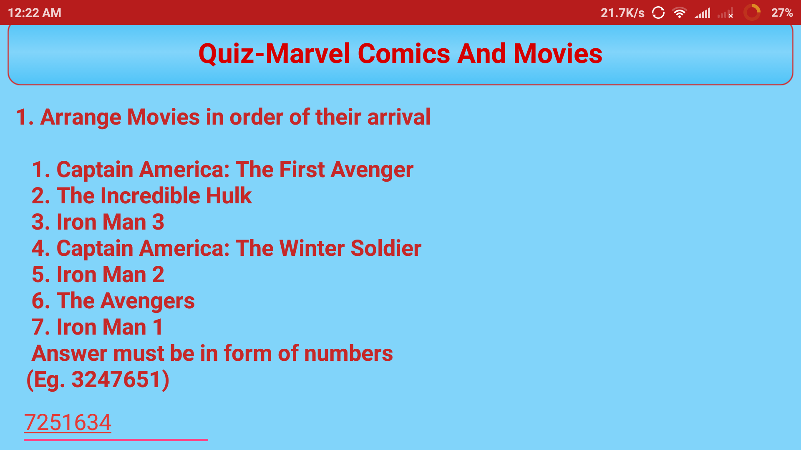
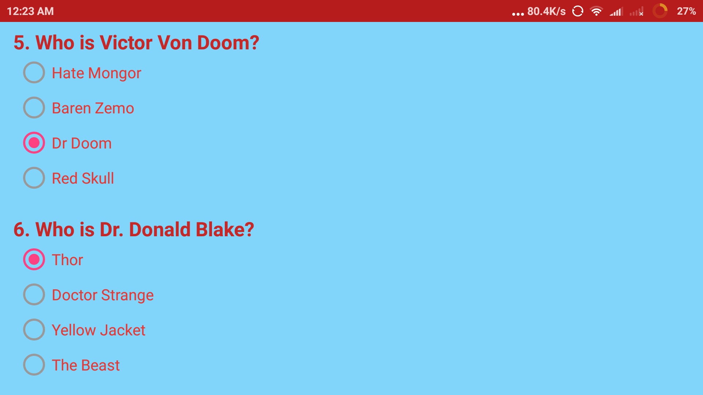

# Udacity and Google India Scholarship Program
## Android Basics Nanodegree Project 3 "Quiz App"
## Name of App - "Quiz"

<b>PROJECT SPECIFICATION</b>

1. App contains 4 - 10 questions, including at least one check box, one radio button, and one text entry.

2. Questions are in a variety of formats such as free text response, checkboxes, and radio buttons. Checkboxes are only used for questions with multiple right answers. Radio buttons are only used for questions with a single right answer.

3. App includes a button for the user to submit their answers and receive a score.

4. The code adheres to all of the following best practices:
   - Text sizes are defined in sp
   - Lengths are defined in dp
   - Padding and margin is used appropriately, such that the views are not crammed up against each other.
   - The app includes at least four of the following Views: TextView, ImageView, Button, Checkbox, EditText, LinearLayout, RelativeLayout, ScrollView, RadioButton, RadioGroup. If applicable, the app uses nested ViewGroups to reduce the complexity of the layout.

5. The app gracefully handles displaying all the content on screen when rotated. Either by updating the layout, adding a scrollable feature or some other mechanism that adheres to Android development guidelines.

6. Each question has a correct answer.

7. Any question which uses radio buttons allows only one to be checked at once.

8. The app contains at least one if/else statement.

9. The grading button displays a toast which accurately displays the results of the quiz.

10. The grading logic checks each answer correctly. The app accurately calculates the number of correct answers and does not include incorrect answers in the count.

<b>About Quiz App</b>

The app contains 10 questions regarding marvel comics and movies.
 - 1 EditText
 - 7 RadioButton
 - 2 CheckBox
 
 All the questions are to be attempted compulsorily to display the final score.
 The final score will be displayed as seperate activity and is populated according to the user final score.

## Quiz App Images
### Portrait
 

 

### Landscape
Used ScrollView so that the whole app is accessible with device having smaller screen size and even in Landscape mode.

Check out "QuizImages" folder for more images.
